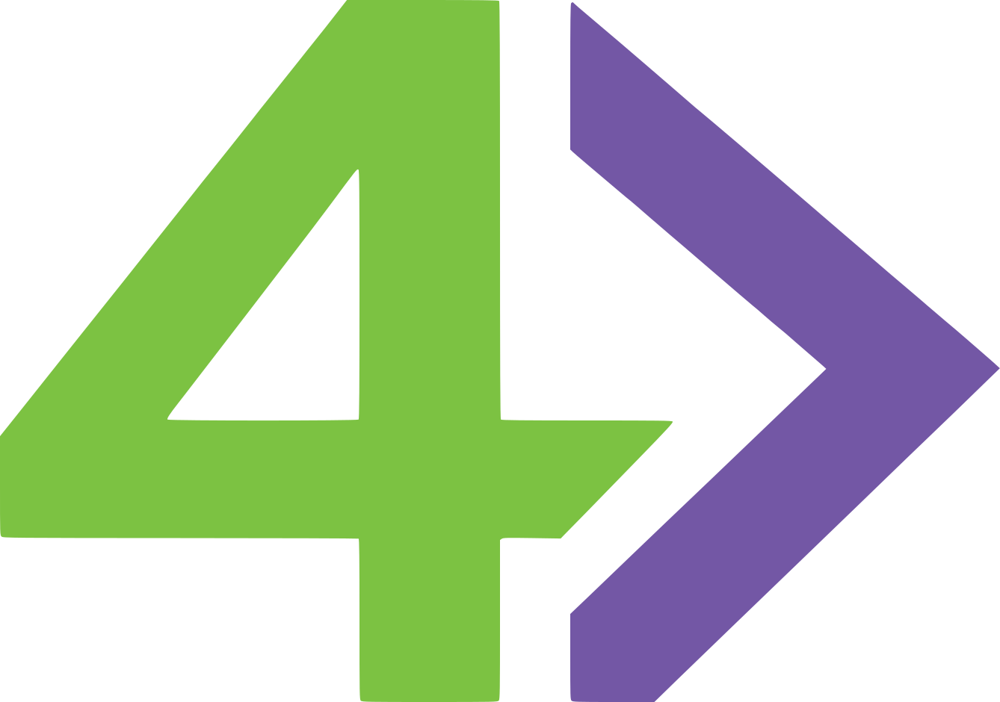

<p align="center">
  
  <br><br>
  <strong>Your P4 programs, finally explained.</strong>
  <br><br>
  <a href="https://github.com/smolkaj/4ward/actions/workflows/ci.yml"></a>
  <a href="https://smolkaj.github.io/4ward/main/"></a>
  <a href="LICENSE"></a>
</p>

# 4ward

Ever stare at a packet leaving a switch and wonder *what just happened in
there?* 4ward is a glass-box P4 simulator that tells you exactly what happened
to your packet — every parser transition, every table lookup, every action, every
branch — delivered as a structured trace tree you can actually read.

```
             p4c + 4ward backend
                     │
                     ▼
              PipelineConfig
             (proto IR + p4info)
                     │
                     ▼
            ┌────────────────┐
 packet ──▶ │  4ward sim     │──▶ output packets
            │  (Kotlin/JVM)  │──▶ trace tree  (the good stuff)
            └────────────────┘
                     ▲
             P4Runtime writes
             (table entries,
              counters, etc.)
```

## Why 4ward?

| | Real hardware | BMv2 | **4ward** |
|---|---|---|---|
| Runs P4 programs | sure | sure | **yep** |
| Spec-compliant | varies | needs workarounds | **by design** |
| Trace format | nope | text | **proto/JSON** |
| All possible traces | nope | not natively | **trace trees!** |
| Architecture-generic | nope | nope | **by design** |
| P4Runtime | sure | has gaps | **100% spec-compliant (planned)** |
| Easy to extend | ehh | ehh | **if AI can extend it, anyone can** |
| Simple, readable codebase | ehh | ehh | **yes!** |

4ward is a **spec-compliant reference implementation** of the
[P4₁₆ language](https://p4.org/wp-content/uploads/sites/53/2024/10/P4-16-spec-v1.2.5.html),
optimised for **correctness and observability** rather than performance. Think of
it as a debugger that speaks P4, not a production data plane.

## Quick start

Tested on macOS and Ubuntu. You need [Bazel](https://bazel.build) 9+ (or just
grab [Bazelisk](https://github.com/bazelbuild/bazelisk) and forget about it)
and a C++20 compiler for the p4c backend. Everything else is hermetic — Bazel
handles it.

```sh
# Build everything.
bazel build //...

# Run all tests (200+ end-to-end scenarios).
bazel test //...
```

## See what your packets are up to

Given a program with an ECMP action selector, 4ward produces a trace tree
showing every possible path — shared prefix first, then a fork for each
selector member:

```protobuf
# shared prefix: parser + table lookup (same for all paths)
events { parser_transition { from_state: "start"  to_state: "accept" } }
events { table_lookup       { table_name: "ecmp"   hit: true          } }

# fork: one branch per action selector member
fork {
  reason: ACTION_SELECTOR
  branches {
    label: "member_0"
    subtree { events { action_execution { action_name: "set_port"
                                          params { key: "port" value: "\001" } } } }
  }
  branches {
    label: "member_1"
    subtree { events { action_execution { action_name: "set_port"
                                          params { key: "port" value: "\002" } } } }
  }
  branches {
    label: "member_2"
    subtree { events { action_execution { action_name: "set_port"
                                          params { key: "port" value: "\003" } } } }
  }
}
```

No printf debugging. No Wireshark. No guessing.

## Not just one trace — all of them

P4 programs have non-deterministic choice points. Action selectors pick a group
member based on an opaque hash. Action profiles let the controller choose
between multiple actions. Multicast replicates packets to different ports.

Other tools pick one path and show you what happened. 4ward will show you what
*could* happen — all possible executions, returned as a **trace tree**:

```
                    ┌─ parse ─ table lookup ─┐
                    │                        │
         packet ────┤       (shared prefix)  ├─── action_selector ─┐
                    │                        │                     │
                    └────────────────────────┘        ┌────────────┼────────────┐
                                                      │            │            │
                                                  member_0     member_1     member_2
                                                      │            │            │
                                                   trace …     trace …     trace …
```

Since execution paths share a common prefix, the tree is compact — shared work
is represented once, and each fork node is labeled with the choice being made.

This is 4ward's killer feature: the tool you reach for when you need to
understand not just what your program *did*, but everything it *can* do.

## Project structure

```
4ward/
├── simulator/              Kotlin simulator — the brain
│   ├── ir.proto            Behavioral IR (the contract between backend & sim)
│   └── simulator.proto     Simulator service protocol (stdin/stdout framing)
├── p4c_backend/            p4c backend plugin (C++, emits the proto IR)
└── e2e_tests/
    ├── stf/                STF runner (shared subprocess + packet I/O)
    ├── corpus/             p4c STF corpus (bulk regression)
    ├── trace_tree/         Golden trace-tree tests
    ├── p4testgen/          p4testgen integration (auto-generated paths)
    └── <feature>/          Hand-written feature tests (passthrough, lpm, …)
```

Curious about the design? [ARCHITECTURE.md](ARCHITECTURE.md) has the full story.

## Where things stand

4ward is pre-1.0 and growing fast. The core pipeline works end-to-end. We will aggressively
refactor to build the best system we can; nothing is sacred except
correctness and the test suite. See [ROADMAP.md](ROADMAP.md) for what's next
and [STATUS.md](STATUS.md) for daily progress.

## Documentation

| Document | Purpose |
|---|---|
| [ARCHITECTURE.md](ARCHITECTURE.md) | Design rationale and component overview |
| [ROADMAP.md](ROADMAP.md) | Development tracks, priorities, and sequencing |
| [STATUS.md](STATUS.md) | Append-only log of daily progress |
| [CONTRIBUTING.md](CONTRIBUTING.md) | How to get involved |
| [AGENTS.md](AGENTS.md) | Guide for AI coding agents |
| [CLAUDE.md](CLAUDE.md) | Claude Code-specific instructions |
| [LIMITATIONS.md](LIMITATIONS.md) | Known shortcuts and gaps |
| [REFACTORING.md](REFACTORING.md) | Tech debt and cleanup backlog |
| [AI_WORKFLOW.md](AI_WORKFLOW.md) | How to develop with AI agents |

## Want to help?

We'd love that! The easiest way to contribute is to pick a failing STF test and
make it pass — they're naturally well-scoped and self-contained. See
[CONTRIBUTING.md](CONTRIBUTING.md) for the full details.

## License

Apache 2.0. See [LICENSE](LICENSE).
